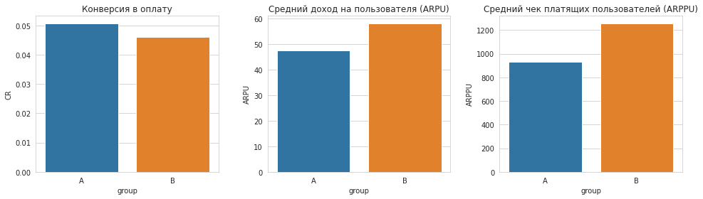

# Финальный проект по аналитике данных

Проект выполнен в рамках финального задания по обучению. Цель — провести разведочный анализ и сформулировать продуктовые/бизнес-гипотезы.

## Используемый стек

- Python (pandas, numpy)
- Визуализация: matplotlib, seaborn
- Jupyter Notebook

## Содержимое

- `Final_project_DA.ipynb` — ноутбук с полным анализом данных

# Проект: вариант 2

# Задание 1. A/B–тест новой механики оплаты

Студент: Мардеева Дарина

Цель: проанализировать итоги эксперимента по новой механике оплаты и решить — запускать ли её на всех пользователей.

## План
1. Загрузка и подготовка данных  
2. Исследование структуры данных  
3. Очистка данных (корректный срез активных пользователей)  
4. Исследование расхождения *checks* и *paying_users*  
5. Выбор метрик для оценки  
6. Анализ различий по метрикам  
7. Проверка статистической значимости  
8. Итоговые выводы


### Задание 1. A/B–тестирование

#### 1.1 Условие

> Одной из основных задач аналитика в нашей команде является корректное проведение экспериментов. Для этого мы применяем метод A/B–тестирования. В ходе тестирования одной гипотезы целевой группе была предложена новая механика оплаты услуг на сайте, у контрольной группы оставалась базовая механика. В качестве задания вам необходимо проанализировать итоги эксперимента и сделать вывод, стоит ли запускать новую механику оплаты на всех пользователей.

#### 1.2 Входные данные

> В качестве входных данных вы имеете 4 csv-файла:
- `groups.csv` – файл с информацией о принадлежности пользователя к контрольной или экспериментальной группе (А – контроль, B – целевая группа) 
- `groups_add.csv` – дополнительный файл с пользователями, который вам прислали спустя 2 дня после передачи данных
- `active_studs.csv` – файл с информацией о пользователях, которые зашли на платформу в дни проведения эксперимента.
- `checks.csv` – файл с информацией об оплатах пользователей в дни проведения эксперимента.

#### 1.3 Вопросы

> Предлагаем вам ответить на следующие вопросы:
- На какие метрики вы смотрите в ходе анализа и почему?
- Имеются ли различия в показателях и с чем они могут быть связаны?
- Являются ли эти различия статистически значимыми?
- Стоит ли запускать новую механику на всех пользователей?
- Данный список вопросов не является обязательным, и вы можете при своём ответе опираться на собственный план.

#### 1.4 Требования к ответу

> - При выполнении тестового задания необходимо использовать язык программирования Python. 
- В файле обязательно должны быть комментарии к тем действиям, которые вы выполняете с данными. 
- Файл должен представлять собой законченный отчёт с выводами, сделанными в ходе исследования.


```python
# Импорт библиотек 

import pandas as pd
import numpy as np
import matplotlib.pyplot as plt
import seaborn as sns
import pingouin as pg
import scipy.stats as stats
import requests
from urllib.parse import urlencode
import matplotlib.pyplot as plt
from scipy.stats import shapiro, levene, ttest_ind, ks_2samp
from statsmodels.stats.proportion import proportions_ztest

%matplotlib inline
sns.set_style("whitegrid")
```


```python
# Ссылки на датасеты
groups_url = 'https://disk.yandex.ru/d/UhyYx41rTt3clQ'
groups_add_url = 'https://disk.yandex.ru/d/5Kxrz02m3IBUwQ'
active_studs_url = 'https://disk.yandex.ru/d/Tbs44Bm6H_FwFQ'
checks_url = 'https://disk.yandex.ru/d/pH1q-VqcxXjsVA'
```


```python
# Функция для получения ссылки на скачивание с Яндекс.Диска

def ydisk_api(public_key: str) -> str:
    base_url = 'https://cloud-api.yandex.net/v1/disk/public/resources/download?'
    url = base_url + urlencode(dict(public_key=public_key))
    response = requests.get(url)
    response.raise_for_status()  # Проверка на ошибки HTTP
    download = response.json()['href']
    return download
```


```python
# Загрузка данных

def load_data(url, sep=','):
    download_url = ydisk_api(url)
    return pd.read_csv(download_url, sep=sep)
```


```python
# Загрузка всех датасетов

groups = load_data(groups_url, sep=';')
groups_add = load_data(groups_add_url, sep=',')
active_studs = load_data(active_studs_url, sep=',')
checks = load_data(checks_url, sep=';')
```

    /opt/tljh/user/lib/python3.7/site-packages/outdated/utils.py:18: OutdatedCacheFailedWarning: Failed to use cache while checking for outdated package.
    Set the environment variable OUTDATED_RAISE_EXCEPTION=1 for a full traceback.
    Set the environment variable OUTDATED_IGNORE=1 to disable these warnings.
      **kwargs
    /opt/tljh/user/lib/python3.7/site-packages/outdated/utils.py:18: OutdatedPackageWarning: The package outdated is out of date. Your version is 0.2.1, the latest is 0.2.2.
    Set the environment variable OUTDATED_IGNORE=1 to disable these warnings.
      **kwargs
    /opt/tljh/user/lib/python3.7/site-packages/outdated/utils.py:18: OutdatedPackageWarning: The package pingouin is out of date. Your version is 0.4.0, the latest is 0.5.5.
    Set the environment variable OUTDATED_IGNORE=1 to disable these warnings.
      **kwargs


# Предварительный анализ данных(EDA)


```python
# Общая информация о датасетах

print("=== Общая информация о датасетах ===")

# файл с информацией о принадлежности пользователя к контрольной или экспериментальной группе 
# (А – контроль, B – целевая группа)
print("\n groups.csv:") 
print(groups.info())

# дополнительный файл с пользователями, который вам прислали спустя 2 дня после передачи данных
print("\n groups_add.csv:")
print(groups_add.info())

# файл с информацией о пользователях, которые зашли на платформу в дни проведения эксперимента
print("\n active_studs.csv:")
print(active_studs.info())

# файл с информацией об оплатах пользователей в дни проведения эксперимента.
print("\n checks.csv:")
print(checks.info())
```

    === Общая информация о датасетах ===
    
     groups.csv:
    <class 'pandas.core.frame.DataFrame'>
    RangeIndex: 74484 entries, 0 to 74483
    Data columns (total 2 columns):
     #   Column  Non-Null Count  Dtype 
    ---  ------  --------------  ----- 
     0   id      74484 non-null  int64 
     1   grp     74484 non-null  object
    dtypes: int64(1), object(1)
    memory usage: 1.1+ MB
    None
    
     groups_add.csv:
    <class 'pandas.core.frame.DataFrame'>
    RangeIndex: 92 entries, 0 to 91
    Data columns (total 2 columns):
     #   Column  Non-Null Count  Dtype 
    ---  ------  --------------  ----- 
     0   id      92 non-null     int64 
     1   grp     92 non-null     object
    dtypes: int64(1), object(1)
    memory usage: 1.6+ KB
    None
    
     active_studs.csv:
    <class 'pandas.core.frame.DataFrame'>
    RangeIndex: 8341 entries, 0 to 8340
    Data columns (total 1 columns):
     #   Column      Non-Null Count  Dtype
    ---  ------      --------------  -----
     0   student_id  8341 non-null   int64
    dtypes: int64(1)
    memory usage: 65.3 KB
    None
    
     checks.csv:
    <class 'pandas.core.frame.DataFrame'>
    RangeIndex: 541 entries, 0 to 540
    Data columns (total 2 columns):
     #   Column      Non-Null Count  Dtype  
    ---  ------      --------------  -----  
     0   student_id  541 non-null    int64  
     1   rev         541 non-null    float64
    dtypes: float64(1), int64(1)
    memory usage: 8.6 KB
    None


```python
# файл с информацией о принадлежности пользователя к контрольной(A) и экспериментальной группе(B)

groups.head()
```


<div>
<style scoped>
    .dataframe tbody tr th:only-of-type {
        vertical-align: middle;
    }

    .dataframe tbody tr th {
        vertical-align: top;
    }

    .dataframe thead th {
        text-align: right;
    }
</style>
<table border="1" class="dataframe">
  <thead>
    <tr style="text-align: right;">
      <th></th>
      <th>id</th>
      <th>grp</th>
    </tr>
  </thead>
  <tbody>
    <tr>
      <th>0</th>
      <td>1489</td>
      <td>B</td>
    </tr>
    <tr>
      <th>1</th>
      <td>1627</td>
      <td>A</td>
    </tr>
    <tr>
      <th>2</th>
      <td>1768</td>
      <td>B</td>
    </tr>
    <tr>
      <th>3</th>
      <td>1783</td>
      <td>B</td>
    </tr>
    <tr>
      <th>4</th>
      <td>1794</td>
      <td>A</td>
    </tr>
  </tbody>
</table>
</div>


```python
# Дополнительный файл с пользователями, который прислали спустя 2 дня после передачи данных

groups_add.head()
```


<div>
<style scoped>
    .dataframe tbody tr th:only-of-type {
        vertical-align: middle;
    }

    .dataframe tbody tr th {
        vertical-align: top;
    }

    .dataframe thead th {
        text-align: right;
    }
</style>
<table border="1" class="dataframe">
  <thead>
    <tr style="text-align: right;">
      <th></th>
      <th>id</th>
      <th>grp</th>
    </tr>
  </thead>
  <tbody>
    <tr>
      <th>0</th>
      <td>5694584</td>
      <td>B</td>
    </tr>
    <tr>
      <th>1</th>
      <td>5694830</td>
      <td>B</td>
    </tr>
    <tr>
      <th>2</th>
      <td>5695057</td>
      <td>B</td>
    </tr>
    <tr>
      <th>3</th>
      <td>5698872</td>
      <td>B</td>
    </tr>
    <tr>
      <th>4</th>
      <td>5699067</td>
      <td>B</td>
    </tr>
  </tbody>
</table>
</div>


```python
# файл с информацией о пользователях, которые зашли на платформу в дни проведения эксперимента

active_studs.head()
```


<div>
<style scoped>
    .dataframe tbody tr th:only-of-type {
        vertical-align: middle;
    }

    .dataframe tbody tr th {
        vertical-align: top;
    }

    .dataframe thead th {
        text-align: right;
    }
</style>
<table border="1" class="dataframe">
  <thead>
    <tr style="text-align: right;">
      <th></th>
      <th>student_id</th>
    </tr>
  </thead>
  <tbody>
    <tr>
      <th>0</th>
      <td>581585</td>
    </tr>
    <tr>
      <th>1</th>
      <td>5723133</td>
    </tr>
    <tr>
      <th>2</th>
      <td>3276743</td>
    </tr>
    <tr>
      <th>3</th>
      <td>4238589</td>
    </tr>
    <tr>
      <th>4</th>
      <td>4475369</td>
    </tr>
  </tbody>
</table>
</div>


```python
# файл с информацией об оплатах пользователей в дни проведения эксперимента

checks.head()
```


<div>
<style scoped>
    .dataframe tbody tr th:only-of-type {
        vertical-align: middle;
    }

    .dataframe tbody tr th {
        vertical-align: top;
    }

    .dataframe thead th {
        text-align: right;
    }
</style>
<table border="1" class="dataframe">
  <thead>
    <tr style="text-align: right;">
      <th></th>
      <th>student_id</th>
      <th>rev</th>
    </tr>
  </thead>
  <tbody>
    <tr>
      <th>0</th>
      <td>1627</td>
      <td>990.0</td>
    </tr>
    <tr>
      <th>1</th>
      <td>3185</td>
      <td>690.0</td>
    </tr>
    <tr>
      <th>2</th>
      <td>25973</td>
      <td>690.0</td>
    </tr>
    <tr>
      <th>3</th>
      <td>26280</td>
      <td>690.0</td>
    </tr>
    <tr>
      <th>4</th>
      <td>100300</td>
      <td>990.0</td>
    </tr>
  </tbody>
</table>
</div>


```python
# Проверка типов полей

print("\n=== Типы полей ===")

print("\n groups.csv:", groups.dtypes)
print("\n groups_add.csv:", groups_add.dtypes)
print("\n active_studs.csv:", active_studs.dtypes)
print("\n checks.csv:", checks.dtypes)
```

    
    === Типы полей ===
    
     groups.csv: id      int64
    grp    object
    dtype: object
    
     groups_add.csv: id      int64
    grp    object
    dtype: object
    
     active_studs.csv: student_id    int64
    dtype: object
    
     checks.csv: student_id      int64
    rev           float64
    dtype: object


```python
# Переименование столбцов для единообразия (на случай разных названий)

groups.columns = ['user_id', 'group']
groups_add.columns = ['user_id', 'group']
active_studs.columns = ['user_id']
checks.columns = ['user_id', 'revenue']
```


```python
# Проверка дубликатов

print("\n groups.csv: дубликатов user_id =", groups['user_id'].duplicated().sum())
print("\n groups_add.csv: дубликатов user_id =", groups_add['user_id'].duplicated().sum())
print("\n active_studs.csv: дубликатов user_id =", active_studs['user_id'].duplicated().sum())
print("\n checks.csv: дубликатов user_id =", checks['user_id'].duplicated().sum())
```

    
     groups.csv: дубликатов user_id = 0
    
     groups_add.csv: дубликатов user_id = 0
    
     active_studs.csv: дубликатов user_id = 0
    
     checks.csv: дубликатов user_id = 0


#### данные в порядке, можем приступить к работе


```python
# Объединяем основные 'groups' и дополнительные 'groups_add' группы
# Определяем, к какой группе относится каждый пользователь.

all_groups = pd.concat([groups, groups_add], ignore_index=True)

print("\n Дубликатов user_id =", all_groups['user_id'].duplicated().sum())
print("\n Размер all_groups:", len(all_groups))
all_groups.head()
```

    
     Дубликатов user_id = 0
    
     Размер all_groups: 74576


<div>
<style scoped>
    .dataframe tbody tr th:only-of-type {
        vertical-align: middle;
    }

    .dataframe tbody tr th {
        vertical-align: top;
    }

    .dataframe thead th {
        text-align: right;
    }
</style>
<table border="1" class="dataframe">
  <thead>
    <tr style="text-align: right;">
      <th></th>
      <th>user_id</th>
      <th>group</th>
    </tr>
  </thead>
  <tbody>
    <tr>
      <th>0</th>
      <td>1489</td>
      <td>B</td>
    </tr>
    <tr>
      <th>1</th>
      <td>1627</td>
      <td>A</td>
    </tr>
    <tr>
      <th>2</th>
      <td>1768</td>
      <td>B</td>
    </tr>
    <tr>
      <th>3</th>
      <td>1783</td>
      <td>B</td>
    </tr>
    <tr>
      <th>4</th>
      <td>1794</td>
      <td>A</td>
    </tr>
  </tbody>
</table>
</div>


```python
# Удаление дубликатов, если есть

if all_groups['user_id'].duplicated().any():
    all_groups = all_groups.drop_duplicates(subset='user_id')
print("Дубликаты удалены. Новый размер all_groups:", len(all_groups))
```

    Дубликаты удалены. Новый размер all_groups: 74576


```python
# Проверка пропусков

print("\nПропуски в groups_all:\n", all_groups.isnull().sum())
print("\nПропуски в active_studs:\n", active_studs.isnull().sum())
print("\nПропуски в checks:\n", checks.isnull().sum())
```

    
    Пропуски в groups_all:
     user_id    0
    group      0
    dtype: int64
    
    Пропуски в active_studs:
     user_id    0
    dtype: int64
    
    Пропуски в checks:
     user_id    0
    revenue    0
    dtype: int64


```python
# Распределение пользователей по группам

group_counts = all_groups['group'].value_counts()
group_counts.reset_index()
```


<div>
<style scoped>
    .dataframe tbody tr th:only-of-type {
        vertical-align: middle;
    }

    .dataframe tbody tr th {
        vertical-align: top;
    }

    .dataframe thead th {
        text-align: right;
    }
</style>
<table border="1" class="dataframe">
  <thead>
    <tr style="text-align: right;">
      <th></th>
      <th>index</th>
      <th>group</th>
    </tr>
  </thead>
  <tbody>
    <tr>
      <th>0</th>
      <td>B</td>
      <td>59883</td>
    </tr>
    <tr>
      <th>1</th>
      <td>A</td>
      <td>14693</td>
    </tr>
  </tbody>
</table>
</div>


```python
# Распределение пользователей по группам в all_groups

plt.figure(figsize=(8, 6))
sns.countplot(data=all_groups, x='group', palette=['#36A2EB', '#FF6384'])
plt.title('Распределение всех пользователей по группам (all_groups)')
plt.xlabel('Группа')
plt.ylabel('Количество пользователей')
plt.xticks(ticks=[0, 1], labels=['Контрольная (A)', 'Тестовая (B)'])
plt.show()
```


```python
# Объединение активных пользователей с их группами

active_users = active_studs.merge(all_groups, left_on='user_id', right_on='user_id', how='left')

print("Активные пользователи без группы:", active_users['group'].isnull().sum())
print("\nАктивные пользователи с группами:")
active_users.head()
```

    Активные пользователи без группы: 0
    
    Активные пользователи с группами:


<div>
<style scoped>
    .dataframe tbody tr th:only-of-type {
        vertical-align: middle;
    }

    .dataframe tbody tr th {
        vertical-align: top;
    }

    .dataframe thead th {
        text-align: right;
    }
</style>
<table border="1" class="dataframe">
  <thead>
    <tr style="text-align: right;">
      <th></th>
      <th>user_id</th>
      <th>group</th>
    </tr>
  </thead>
  <tbody>
    <tr>
      <th>0</th>
      <td>581585</td>
      <td>A</td>
    </tr>
    <tr>
      <th>1</th>
      <td>5723133</td>
      <td>A</td>
    </tr>
    <tr>
      <th>2</th>
      <td>3276743</td>
      <td>B</td>
    </tr>
    <tr>
      <th>3</th>
      <td>4238589</td>
      <td>A</td>
    </tr>
    <tr>
      <th>4</th>
      <td>4475369</td>
      <td>B</td>
    </tr>
  </tbody>
</table>
</div>


```python
# Распределение активных пользователей по группам в active_users

plt.figure(figsize=(8, 6))
sns.countplot(data=active_users, x='group', palette=['#36A2EB', '#FF6384'])
plt.title('Распределение активных пользователей по группам (active_users)')
plt.xlabel('Группа')
plt.ylabel('Количество пользователей')
plt.xticks(ticks=[0, 1], labels=['Контрольная (A)', 'Тестовая (B)'])
plt.show()
```


```python
# Проверка оплат

print(f"Всего записей об оплатах: {len(checks)}")
print("\nОписательная статистика revenue:")
checks['revenue'].describe().reset_index()
```

    Всего записей об оплатах: 541
    
    Описательная статистика revenue:


<div>
<style scoped>
    .dataframe tbody tr th:only-of-type {
        vertical-align: middle;
    }

    .dataframe tbody tr th {
        vertical-align: top;
    }

    .dataframe thead th {
        text-align: right;
    }
</style>
<table border="1" class="dataframe">
  <thead>
    <tr style="text-align: right;">
      <th></th>
      <th>index</th>
      <th>revenue</th>
    </tr>
  </thead>
  <tbody>
    <tr>
      <th>0</th>
      <td>count</td>
      <td>541.000000</td>
    </tr>
    <tr>
      <th>1</th>
      <td>mean</td>
      <td>1059.752317</td>
    </tr>
    <tr>
      <th>2</th>
      <td>std</td>
      <td>762.712359</td>
    </tr>
    <tr>
      <th>3</th>
      <td>min</td>
      <td>199.000000</td>
    </tr>
    <tr>
      <th>4</th>
      <td>25%</td>
      <td>290.000000</td>
    </tr>
    <tr>
      <th>5</th>
      <td>50%</td>
      <td>840.000000</td>
    </tr>
    <tr>
      <th>6</th>
      <td>75%</td>
      <td>1900.000000</td>
    </tr>
    <tr>
      <th>7</th>
      <td>max</td>
      <td>4650.000000</td>
    </tr>
  </tbody>
</table>
</div>


```python
# Проверка аномалий в оплатах

print("\nПроверка аномалий в revenue:\n")
print("Отрицательные значения revenue:", (checks['revenue'] < 0).sum())
print("Нулевые значения revenue:", (checks['revenue'] == 0).sum())
print("Крайне высокие значения revenue (> 99-й перцентиль):",
      len(checks[checks['revenue'] > checks['revenue'].quantile(0.99)]))
```

    
    Проверка аномалий в revenue:
    
    Отрицательные значения revenue: 0
    Нулевые значения revenue: 0
    Крайне высокие значения revenue (> 99-й перцентиль): 6


```python
# Проверка аномалий в оплатах с детализацией по user_id

outliers = checks[checks['revenue'] > checks['revenue'].quantile(0.99)]
print(f"\nАномально высокие оплаты (выше 99-го перцентиля):\n")
outliers
```

    
    Аномально высокие оплаты (выше 99-го перцентиля):
    


<div>
<style scoped>
    .dataframe tbody tr th:only-of-type {
        vertical-align: middle;
    }

    .dataframe tbody tr th {
        vertical-align: top;
    }

    .dataframe thead th {
        text-align: right;
    }
</style>
<table border="1" class="dataframe">
  <thead>
    <tr style="text-align: right;">
      <th></th>
      <th>user_id</th>
      <th>revenue</th>
    </tr>
  </thead>
  <tbody>
    <tr>
      <th>64</th>
      <td>445767</td>
      <td>3660.0</td>
    </tr>
    <tr>
      <th>130</th>
      <td>829330</td>
      <td>3660.0</td>
    </tr>
    <tr>
      <th>224</th>
      <td>1624158</td>
      <td>3660.0</td>
    </tr>
    <tr>
      <th>231</th>
      <td>1711305</td>
      <td>4650.0</td>
    </tr>
    <tr>
      <th>253</th>
      <td>2150601</td>
      <td>3660.0</td>
    </tr>
    <tr>
      <th>511</th>
      <td>5316551</td>
      <td>3660.0</td>
    </tr>
  </tbody>
</table>
</div>


```python
# Визуализация распределения revenue

plt.figure(figsize=(10, 6))
sns.histplot(checks['revenue'], bins=50, kde=True)
plt.title('Распределение revenue в checks.csv')
plt.xlabel('Revenue')
plt.ylabel('Частота')
plt.show()
```


```python
# Проверка оплат неактивных пользователей

non_active_payments = checks[~checks['user_id'].isin(active_users['user_id'])]
if len(non_active_payments) > 0:
    print(f"Оплат от неактивных пользователей: {len(non_active_payments)}")
non_active_payments.head()
```

    Оплат от неактивных пользователей: 149


<div>
<style scoped>
    .dataframe tbody tr th:only-of-type {
        vertical-align: middle;
    }

    .dataframe tbody tr th {
        vertical-align: top;
    }

    .dataframe thead th {
        text-align: right;
    }
</style>
<table border="1" class="dataframe">
  <thead>
    <tr style="text-align: right;">
      <th></th>
      <th>user_id</th>
      <th>revenue</th>
    </tr>
  </thead>
  <tbody>
    <tr>
      <th>1</th>
      <td>3185</td>
      <td>690.0</td>
    </tr>
    <tr>
      <th>2</th>
      <td>25973</td>
      <td>690.0</td>
    </tr>
    <tr>
      <th>3</th>
      <td>26280</td>
      <td>690.0</td>
    </tr>
    <tr>
      <th>5</th>
      <td>100645</td>
      <td>630.0</td>
    </tr>
    <tr>
      <th>6</th>
      <td>102534</td>
      <td>580.0</td>
    </tr>
  </tbody>
</table>
</div>


```python
# Добавление информации об оплатах к активным пользователям. 

active_users_pay = active_users.merge(checks, on='user_id', how='left')
active_users_pay['revenue'] = active_users_pay['revenue'].fillna(0)  # Заполняем 0 для пользователей без оплат
active_users_pay['converted'] = (active_users_pay['revenue'] > 0).astype(int)

print("\n=== Размер выборки: ===\n")
print(f"Размер объединенного датасета: {len(active_users_pay)}")
print(f"Контрольная группа (A): {len(active_users_pay[active_users_pay['group'] == 'A'])}")
print(f"Тестовая группа (B): {len(active_users_pay[active_users_pay['group'] == 'B'])}")
active_users_pay
```

    
    === Размер выборки: ===
    
    Размер объединенного датасета: 8341
    Контрольная группа (A): 1538
    Тестовая группа (B): 6803


<div>
<style scoped>
    .dataframe tbody tr th:only-of-type {
        vertical-align: middle;
    }

    .dataframe tbody tr th {
        vertical-align: top;
    }

    .dataframe thead th {
        text-align: right;
    }
</style>
<table border="1" class="dataframe">
  <thead>
    <tr style="text-align: right;">
      <th></th>
      <th>user_id</th>
      <th>group</th>
      <th>revenue</th>
      <th>converted</th>
    </tr>
  </thead>
  <tbody>
    <tr>
      <th>0</th>
      <td>581585</td>
      <td>A</td>
      <td>0.0</td>
      <td>0</td>
    </tr>
    <tr>
      <th>1</th>
      <td>5723133</td>
      <td>A</td>
      <td>0.0</td>
      <td>0</td>
    </tr>
    <tr>
      <th>2</th>
      <td>3276743</td>
      <td>B</td>
      <td>0.0</td>
      <td>0</td>
    </tr>
    <tr>
      <th>3</th>
      <td>4238589</td>
      <td>A</td>
      <td>0.0</td>
      <td>0</td>
    </tr>
    <tr>
      <th>4</th>
      <td>4475369</td>
      <td>B</td>
      <td>0.0</td>
      <td>0</td>
    </tr>
    <tr>
      <th>...</th>
      <td>...</td>
      <td>...</td>
      <td>...</td>
      <td>...</td>
    </tr>
    <tr>
      <th>8336</th>
      <td>1794344</td>
      <td>B</td>
      <td>0.0</td>
      <td>0</td>
    </tr>
    <tr>
      <th>8337</th>
      <td>296883</td>
      <td>B</td>
      <td>0.0</td>
      <td>0</td>
    </tr>
    <tr>
      <th>8338</th>
      <td>3598448</td>
      <td>B</td>
      <td>0.0</td>
      <td>0</td>
    </tr>
    <tr>
      <th>8339</th>
      <td>3610547</td>
      <td>B</td>
      <td>290.0</td>
      <td>1</td>
    </tr>
    <tr>
      <th>8340</th>
      <td>205705</td>
      <td>B</td>
      <td>0.0</td>
      <td>0</td>
    </tr>
  </tbody>
</table>
<p>8341 rows × 4 columns</p>
</div>


```python
# Проверка платящих пользователей

paying_users = active_users_pay[active_users_pay['revenue'] > 0]
print(f"\nПлатящих пользователей: {len(paying_users)}")
print(f"Доля платящих пользователей: {len(paying_users) / len(active_users_pay):.4f}")
```

    
    Платящих пользователей: 392
    Доля платящих пользователей: 0.0470


### Итого у нас получается 3 датасета

> - `all_groups` - id студентов и их принадлежность к группе A/B теста.
- `active_users` - Активные пользователи, зашедшие во время эксперимента c принадлежностью к группе.
- `active_users_pay` - Активные пользователи и их оплаты.

#### Предварительный анализ данных и возможные проблемы

При сопоставлении данных по активным пользователям и платящим пользователям выявлено следующее:

- В `checks.csv` содержится 541 уникальный платящий пользователь.
- В `active_studs.csv` содержится меньшее число платящих пользователей — 392, которые попадают в датасет `paying_users`.

Следовательно, 149 пользователей совершили оплату, но не были зафиксированы в активности в дни проведения эксперимента.

Возможные причины:
- Автоплатежи — наиболее вероятная гипотеза. У пользователей мог быть настроен автоматический платеж, который не требует посещения платформы. Это объясняет их отсутствие в `active_studs.csv`.
- Технические баги или несовпадение логики трекинга активности и трекинга оплат — например, пользователи могли оплачивать через сторонний интерфейс (мобильное приложение банка, партнерский сайт и т.п.).
- Ошибки при сплитовании / выгрузке данных — например, активность зафиксирована не полностью или не по тем же временным границам, что оплата.

Так как мы **тестируем новую механику оплаты**, в которой важен пользовательский опыт в интерфейсе (новая форма / кнопка / сценарий), учитывать “невидимых” пользователей, у которых произошла оплата без посещения платформы, нецелесообразно:

- они не взаимодействовали с новой механикой (или старой) в момент эксперимента;
- их поведение не связано с UX-тестом.

**Таким образом, 149 “внешних” платящих пользователей нужно исключить из анализа — что мы и делаем, ограничиваясь пользователями из `active_studs.csv`.**

#### Важно отметить, что соотношение контрольной и целевой группы остаётся стабильным (~80/20) даже после очистки данных, что позволяет нам корректно интерпретировать дальнейшие результаты.

### Вывод:

Мы можем продолжить анализ, опираясь на очищенные данные по активным пользователям, не опасаясь серьёзного влияния этого смещения на достоверность A/B-теста.

## 1.3 Вопросы

1. На какие метрики вы смотрите в ходе анализа и почему?
2. Имеются ли различия в показателях и с чем они могут быть связаны?
3. Являются ли эти различия статистически значимыми?
4. Стоит ли запускать новую механику на всех пользователей?

**1. Так как мы исследуем механику оплаты, логично выбрать метрики, отражающие то, как часто пользователи платят и сколько платят.**
> - CR — конверсия в оплаты. Покажет стали ли больше совершать покупки с новой механникой оплаты. 
> - ARPU(Средний доход на пользователя). Изменится ли выручка со студента с новой механикой.
> - ARPPU(Средний доход на платящего пользователя). Изменится ли выручка с платящего студента.


```python
# === Расчет метрик ===
metrics = active_users_pay.groupby('group', as_index=False).agg(
    users=('user_id', 'count'),
    paying_users=('revenue', lambda x: (x > 0).sum()),
    total_revenue=('revenue', 'sum')
)
metrics['CR'] = metrics['paying_users'] / metrics['users']
metrics['ARPU'] = metrics['total_revenue'] / metrics['users']
metrics['ARPPU'] = metrics['total_revenue'] / metrics['paying_users']
print("\n=== Метрики по группам ===")
metrics
```

    
    === Метрики по группам ===


<div>
<style scoped>
    .dataframe tbody tr th:only-of-type {
        vertical-align: middle;
    }

    .dataframe tbody tr th {
        vertical-align: top;
    }

    .dataframe thead th {
        text-align: right;
    }
</style>
<table border="1" class="dataframe">
  <thead>
    <tr style="text-align: right;">
      <th></th>
      <th>group</th>
      <th>users</th>
      <th>paying_users</th>
      <th>total_revenue</th>
      <th>CR</th>
      <th>ARPU</th>
      <th>ARPPU</th>
    </tr>
  </thead>
  <tbody>
    <tr>
      <th>0</th>
      <td>A</td>
      <td>1538</td>
      <td>78.0</td>
      <td>72820.0000</td>
      <td>0.050715</td>
      <td>47.347204</td>
      <td>933.589744</td>
    </tr>
    <tr>
      <th>1</th>
      <td>B</td>
      <td>6803</td>
      <td>314.0</td>
      <td>394974.0035</td>
      <td>0.046156</td>
      <td>58.058798</td>
      <td>1257.878992</td>
    </tr>
  </tbody>
</table>
</div>


```python
# Визуализация метрик
plt.figure(figsize=(14, 4))

plt.subplot(1, 3, 1)
sns.barplot(data=metrics, x='group', y='CR')
plt.title('Конверсия в оплату')
plt.ylabel('CR')

plt.subplot(1, 3, 2)
sns.barplot(data=metrics, x='group', y='ARPU')
plt.title('Средний доход на пользователя (ARPU)')
plt.ylabel('ARPU')

plt.subplot(1, 3, 3)
sns.barplot(data=metrics, x='group', y='ARPPU')
plt.title('Средний чек платящих пользователей (ARPPU)')
plt.ylabel('ARPPU')

plt.tight_layout()
plt.show()
```





### Гипотезы

#### Конверсия в оплату (CR)
- **H0**: Конверсия в оплату в группах A и B одинакова (p_A = p_B).
- **H1**: Конверсия в оплату в группах A и B различается (p_A ≠ p_B).

#### Средний доход на пользователя (ARPU)
- **H0**: Средний доход на пользователя в группах A и B одинаков (μ_A = μ_B).
- **H1**: Средний доход на пользователя в группах A и B различается (μ_A ≠ μ_B).

#### Средний чек платящих пользователей (ARPPU)
- **H0**: Средний чек платящих пользователей в группах A и B одинаков (μ_A = μ_B).
- **H1**: Средний чек платящих пользователей в группах A и B различается (μ_A ≠ μ_B).

#### Определим, является ли распределение оплат (revenue) нормальным, так как это повлияет на выбор тестов для ARPU и ARPPU.


```python
# Статистическая проверка
# Проверяем нормальность распределения оплат (для информации)

print("\nПроверка нормальности распределения оплат (Shapiro-Wilk):")
for group in ['A', 'B']:
    rev = active_users_pay[active_users_pay['group'] == group]['revenue']
    stat, p = stats.shapiro(rev[rev > 0])
    print(f"Группа {group}: p-value = {p:.4f}")
```

    
    Проверка нормальности распределения оплат (Shapiro-Wilk):
    Группа A: p-value = 0.0000
    Группа B: p-value = 0.0000


``` Распределение оплат ненормальное (p-value < 0.05), поэтому используем:```
- Для ARPU используем t-тест (большая выборка)
- Для ARPPU — T-тест, если дисперсии равны, иначе бутстрэп.

#### Проверим, есть ли статистически значимые различия в конверсии (доле платящих пользователей) между группами A (5.07%) и B (4.62%).


```python
# Конверсия: Z-тест

conv_a = active_users_pay[active_users_pay['group'] == 'A']['converted'].sum()
conv_b = active_users_pay[active_users_pay['group'] == 'B']['converted'].sum()
n_a = active_users_pay[active_users_pay['group'] == 'A']['user_id'].count()
n_b = active_users_pay[active_users_pay['group'] == 'B']['user_id'].count()

stat, pval = proportions_ztest([conv_a, conv_b], [n_a, n_b])

print("\nZ-тест для конверсии: stat = {:.4f}, p-value = {:.4f}".format(stat, pval))
print("Вывод: Различия в конверсии", "значимы" if pval < 0.05 else "не значимы")
```

    
    Z-тест для конверсии: stat = 0.7630, p-value = 0.4455
    Вывод: Различия в конверсии не значимы


> #### Конверсия в оплату (CR)
- **H0**: Конверсия в оплату в группах A и B одинакова (p_A = p_B).
- **H1**: Конверсия в оплату в группах A и B различается (p_A ≠ p_B).

> Разница в конверсиях статистически незначима (p-value > 0.05), значит **мы не отклоняем нулевую гипотезу** и считаем, что конверсии в группах равны. Наблюдаемые различия могут быть связаны со случайными колебаниями или дисбалансом в размерах групп. Либо реальное влияние механики на CR крайне мало.

### Анализ ARPU (средний доход на всех пользователей)

**Что проверяем**: Узнаём, вырос ли средний доход (ARPU) в группе B (58.06) по сравнению с A (47.35).

**Методы**:
- Левена: Проверяем, одинаковый ли разброс доходов.
- T-тест: Если дисперсии равны (p > 0.05), сравниваем средние.
- Бутстрэп: Если дисперсии различаются (p < 0.05), проверяем разницу средних.

**Почему**: T-тест надёжен для больших выборок (1538 в A, 6803 в B), бутстрэп устойчив к ненормальности и неравным дисперсиям.


```python
# ARPU: T-тест
# Гипотезы:
# H0: ARPU в группах A и B одинаков
# H1: ARPU в группах A и B различается

arpu_a = active_users_pay[active_users_pay['group'] == 'A']['revenue']
arpu_b = active_users_pay[active_users_pay['group'] == 'B']['revenue']
```


```python
# Стандартные отклонения

print(f"Стандартное отклонение ARPU (A): {np.std(arpu_a):.2f}")
print(f"Стандартное отклонение ARPU (B): {np.std(arpu_b):.2f}")
```

    Стандартное отклонение ARPU (A): 290.40
    Стандартное отклонение ARPU (B): 313.75


```python
# Проверка равенства дисперсий

stat_levene_arpu, p_levene_arpu = levene(arpu_a, arpu_b)
print(f"\nТест Левена для ARPU: stat = {stat_levene_arpu:.4f}, p-value = {p_levene_arpu:.4f}")
equal_var_arpu = p_levene_arpu > 0.05
```

    
    Тест Левена для ARPU: stat = 1.5015, p-value = 0.2205


```python
# T-тест

t_stat_arpu, pval_arpu = ttest_ind(arpu_a, arpu_b, equal_var=equal_var_arpu)
print(f"T-тест для ARPU: t = {t_stat_arpu:.4f}, p-value = {pval_arpu:.4f}")
print("Вывод: Различия в ARPU", "значимы" if pval_arpu < 0.05 else "не значимы")
```

    T-тест для ARPU: t = -1.2253, p-value = 0.2205
    Вывод: Различия в ARPU не значимы


- Стандартное отклонение ARPU (A): 290.40
- Стандартное отклонение ARPU (B): 313.75
- Тест Левена для ARPU: stat = 1.5015, p-value = 0.2205
- T-тест для ARPU: t = -1.2253, p-value = 0.2205
- Различия в ARPU не значимы

**Вывод:** Поскольку p = 0.2205 > 0.05, дисперсии равны, поэтому используется T-тест.

> #### Средний доход на пользователя (ARPU)
- **H0**: Средний доход на пользователя в группах A и B одинаков (μ_A = μ_B).
- **H1**: Средний доход на пользователя в группах A и B различается (μ_A ≠ μ_B).

> Различия в ARPU статистически незначимы (p-value > 0.05), значит **мы принимаем нулевую гипотезу** и считаем, что ARPU в группах не различается. Наблюдаемая разница может быть обусловлена случайными колебаниями данных.

### Анализ ARPPU (средний чек платящих пользователей)

**Что проверяем**: Узнаём, вырос ли средний чек платящих (ARPPU) в группе B (1257.88) по сравнению с A (933.59).

**Методы**:
- Левена: Проверяем, одинаковый ли разброс чеков.
- T-тест: Если дисперсии равны (p > 0.05), сравниваем средние.
- Бутстрэп: Если дисперсии различаются (p < 0.05), проверяем разницу средних.

**Почему**: T-тест проверяет средние, бутстрэп устойчив к ненормальности и неравным дисперсиям.


```python
# ARPPU: T-тест
# Гипотезы:
# H0: ARPPU в группах A и B одинаков
# H1: ARPPU в группах A и B различается

rev_a = active_users_pay[(active_users_pay['group'] == 'A') & (active_users_pay['revenue'] > 0)]['revenue']
rev_b = active_users_pay[(active_users_pay['group'] == 'B') & (active_users_pay['revenue'] > 0)]['revenue']
```


```python
# Стандартные отклонения

print(f"Стандартное отклонение ARPPU (A): {np.std(rev_a):.2f}")
print(f"Стандартное отклонение ARPPU (B): {np.std(rev_b):.2f}")
```

    Стандартное отклонение ARPPU (A): 914.02
    Стандартное отклонение ARPPU (B): 789.60


```python
# Проверка равенства дисперсий

stat_levene_arppu, p_levene_arppu = levene(rev_a, rev_b)
print(f"\nТест Левена для ARPPU: stat = {stat_levene_arppu:.4f}, p-value = {p_levene_arppu:.4f}")
equal_var_arppu = p_levene_arppu > 0.05
```

    
    Тест Левена для ARPPU: stat = 3.0757, p-value = 0.0803


```python
# T-тест

t_stat_arppu, pval_arppu = ttest_ind(rev_a, rev_b, equal_var=equal_var_arppu)
print(f"T-тест для ARPPU: t = {t_stat_arppu:.4f}, p-value = {pval_arppu:.4f}")
print("Вывод: Различия в ARPPU", "значимы" if pval_arppu < 0.05 else "не значимы")
```

    T-тест для ARPPU: t = -3.1338, p-value = 0.0019
    Вывод: Различия в ARPPU значимы


- Стандартное отклонение ARPPU (A): 914.02
- Стандартное отклонение ARPPU (B): 789.60
- Тест Левена для ARPPU: stat = 3.0757, p-value = 0.0803
- T-тест для ARPPU: t = -3.1338, p-value = 0.0019
- Различия в ARPPU значимы

**Вывод:** Поскольку p = 0.0803 > 0.05, дисперсии равны, поэтому используется T-тест.

> #### Средний чек платящих пользователей (ARPPU)
- **H0**: Средний чек платящих пользователей в группах A и B одинаков (μ_A = μ_B).
- **H1**: Средний чек платящих пользователей в группах A и B различается (μ_A ≠ μ_B).
    
> Различия в ARPPU статистически значимы (p-value < 0.05), значит **мы отклоняем нулевую гипотезу и принимаем альтернативную**, что ARPPU в группах различается. Это может быть важным для бизнеса, так как увеличение ARPPU может привести к значительному увеличению доходов.


```python
# Гистограмма и боксплот показывают различия в чеках платящих пользователей.

# Гистограмма
plt.figure(figsize=(10, 6))
sns.histplot(data=active_users_pay[active_users_pay['revenue'] > 0], x='revenue', hue='group', bins=30, kde=True)
plt.title('Распределение доходов платящих пользователей (ARPPU)')
plt.xlabel('Доход (revenue)')
plt.ylabel('Частота')
plt.show()

# Боксплот
plt.figure(figsize=(10, 6))
sns.boxplot(x='group', y='revenue', data=active_users_pay[active_users_pay['revenue'] > 0])
plt.title('Боксплот доходов платящих пользователей (ARPPU)')
plt.xlabel('Группа')
plt.ylabel('Доход (revenue)')
plt.show()
```


**2. Имеются ли различия в показателях и с чем они могут быть связаны?**

**Показатели**:
- **CR**: A = 5.07% (78/1538), B = 4.62% (314/6803). Конверсия ниже в B.
- **ARPU**: A = 47.35, B = 58.06. Выше в B, но не значительно.
- **ARPPU**: A = 933.59, B = 1257.88. Значительно выше в B.

**Причины**:
- **Рост ARPPU**: Новая механика упрощает крупные транзакции (например, тариф ~1900, виден на гистограмме).
- **Снижение CR**: Непривычный интерфейс может отпугивать пользователей, особенно для мелких покупок.
- **ARPU без изменений**: Снижение конверсии компенсирует рост ARPPU, поэтому общая выручка не растёт.

**3. Являются ли эти различия статистически значимыми?**
- **Конверсия (CR):**
p-value = 0.4455 (z-тест). Различия не значимы. Новая механика не влияет на долю платящих пользователей.
- **ARPU:**
p-value = 0.2205 (T-тест, дисперсии равны). Различия не значимы. Новая механика не приводит к значимому росту общей выручки на пользователя.
- **ARPPU:**
p-value = 0.0019 (T-тест, дисперсии равны). Различия значимы. Новая механика увеличивает средний чек платящих пользователей.

**4. Рекомендация по запуску:**

**Анализ**:
- **Плюсы**: Значимый рост ARPPU (933.59 → 1257.88, p = 0.0019) показывает, что платящие тратят больше.
- **Минусы**: ARPU не вырос (p = 0.2205), конверсия слегка снизилась (p = 0.4455, не значимо). Общая выручка не увеличилась.

**Риски**: Снижение CR (4.62% vs 5.07%) может указывать на UX-проблемы для мелких транзакций.

**Рекомендация**: Не запускать механику на всех пользователей. Провести:
1. Сегментный анализ (например, для премиум-продуктов).
2. UX-тесты для упрощения интерфейса мелких покупок.
3. Повторный тест с большей выборкой для A (1538 vs 6803).
4. Проверку 149 неактивных плательщиков (автоплатежи).

**Итог**: Рост ARPPU перспективен, но снижение CR и отсутствие роста ARPU требуют доработки механики.

### Общий вывод

В ходе A/B-тестирования новой механики оплаты проанализированы три ключевые метрики: конверсия в оплату (CR), средний доход на пользователя (ARPU) и средний чек платящих пользователей (ARPPU).

**Конверсия в оплату (CR):**

Группа A: 5.07% (78 из 1538 пользователей).
Группа B: 4.62% (314 из 6803 пользователей).
Z-тест для пропорций: stat = 0.7630, p-value = 0.4455.

> Вывод: Различия в конверсии не значимы (p > 0.05). Новая механика не влияет на долю платящих пользователей. Лёгкое снижение конверсии в группе B (4.62% против 5.07%) может быть случайным или связано с непривычным интерфейсом.

**Средний доход на пользователя (ARPU):**

Группа A: 47.35.
Группа B: 58.06.
Тест Левена: stat = 1.5015, p-value = 0.2205 (дисперсии равны).
T-тест: t = -1.2253, p-value = 0.2205.
> Вывод: Различия в ARPU не значимы (p > 0.05). Новая механика не увеличивает общую выручку на пользователя. Численный рост ARPU в группе B компенсируется снижением конверсии.

**Средний чек платящих пользователей (ARPPU):**

Группа A: 933.59.
Группа B: 1257.88.
Тест Левена: stat = 3.0757, p-value = 0.0803 (дисперсии равны).
T-тест: t = -3.1338, p-value = 0.0019.
> Вывод: Различия в ARPPU значимы (p < 0.05). Новая механика увеличивает средний чек платящих пользователей, вероятно, за счёт упрощения крупных транзакций (например, тариф около 1900, виден на гистограмме).


##### Аномалии в данных:

Обнаружено 149 пользователей с оплатами, не зафиксированных как активные в дни эксперимента. Эти пользователи исключены из анализа, так как их оплаты, вероятно, связаны с автоплатежами или сторонними интерфейсами, не относящимися к тестируемой механике.

##### Причины различий

Рост ARPPU: Новая механика упрощает оплату крупных транзакций или стимулирует выбор более дорогих продуктов (например, премиум-тариф около 1900).
Снижение конверсии: Непривычность или сложность интерфейса может отпугивать пользователей, склонных к мелким покупкам.
ARPU без изменений: Снижение конверсии компенсирует рост среднего чека, что не позволяет общей выручке значимо вырасти.

##### Рекомендация по запуску

Новая механика оплаты демонстрирует значимый рост ARPPU (с 933.59 до 1257.88, p = 0.0019), что указывает на её способность увеличивать суммы транзакций среди платящих пользователей. Однако конверсия в группе B немного ниже (4.62% против 5.07%, p = 0.4455, не значимо), а ARPU не показывает значимого роста (58.06 против 47.35, p = 0.2205).

##### Рекомендация: 
Не запускать новую механику на всех пользователей, так как она не приводит к значимому росту общей выручки (ARPU). 

> Возможные действия:
Провести сегментный анализ, чтобы выявить группы пользователей (например, покупающих премиум-продукты), для которых новая механика эффективна, и внедрить её выборочно.
Исследовать причины снижения конверсии (например, A/B-тест с упрощённым интерфейсом).
Провести повторный тест с большей выборкой для группы A (1538 пользователей против 6803 в группе B), чтобы повысить точность.
Проверить 149 неактивных плательщиков на предмет автоплатежей или ошибок в данных.

**Итог: Рост ARPPU перспективен, но отсутствие роста ARPU и лёгкое снижение конверсии требуют доработки механики перед полным запуском.**

# Задание 2. SQL

### 2.1 Очень усердные ученики.

#### 2.1.1 Условие

Образовательные курсы состоят из различных уроков, каждый из которых состоит из нескольких маленьких заданий. Каждое такое маленькое задание называется "горошиной".

Назовём очень усердным учеником того пользователя, который хотя бы раз за текущий месяц `правильно` решил 20 горошин.

#### 2.1.2 Задача

Необходимо написать оптимальный запрос, который даст информацию о количестве очень усердных студентов.NB! Под усердным студентом мы понимаем студента, который правильно решил 20 задач за текущий месяц.

# SQL код запроса


```
SELECT COUNT(DISTINCT st_id) AS very_diligent_students
FROM (
    SELECT 
        st_id,
        DATE_TRUNC('month', timest) AS month,
        COUNT(*) AS correct_peas
    FROM peas
    WHERE correct = TRUE
    GROUP BY st_id, DATE_TRUNC('month', timest)
    HAVING COUNT(*) >= 20
) AS sub;

```

### Выдача по запросу: very_diligent_students 136	

### Пояснение:

>1. Внутренний SELECT:
 - группирует данные по студенту и месяцу (используем DATE_TRUNC('month', timest) для выделения месяца);
 - считает количество правильно решённых горошин для каждой пары (студент, месяц);
 - фильтрует те пары, где количество >= 20 (усердные студенты за месяц).
2.	Внешний SELECT:
 - считает уникальное количество студентов (COUNT(DISTINCT st_id)), которые попали хотя бы в одну такую пару (т.е. за какой-то месяц были усердными).

### 2.2 Оптимизация воронки

#### 2.2.1 Условие

Образовательная платформа предлагает пройти студентам курсы по модели trial: студент может решить бесплатно лишь 30 горошин в день. Для неограниченного количества заданий в определенной дисциплине студенту необходимо приобрести полный доступ. Команда провела эксперимент, где был протестирован новый экран оплаты.

#### 2.2.2 Задача

Необходимо в одном запросе выгрузить следующую информацию о группах пользователей:

- ARPU 
- ARPAU 
- CR в покупку 
- СR активного пользователя в покупку 
- CR пользователя из активности по математике (subject = ’math’) в покупку курса по математике
- ARPU считается относительно всех пользователей, попавших в группы.

`Активным` считается пользователь, за все время решивший `больше 10 задач правильно в любых дисциплинах`.

`Активным` по математике считается пользователь, за все время решивший `2 или больше задач правильно по математике`.

```
WITH 
-- 1. Все пользователи
all_users AS ( SELECT st_id, test_grp FROM studs ),
-- 2. Все покупки
purchases AS ( SELECT st_id, money, subject FROM final_project_check ),
-- 3. Активные пользователи (более 10 правильных решений)
active_users AS ( SELECT st_id FROM peas WHERE correct = TRUE GROUP BY st_id HAVING COUNT(*) > 10 ),
-- 4. Активные по математике (2+ правильных решений по math)
active_math_users AS ( SELECT st_id FROM peas WHERE correct = TRUE AND subject = 'math' GROUP BY st_id HAVING COUNT(*) >= 2 ),
-- 5. Покупатели math курса
math_buyers AS ( SELECT st_id FROM final_project_check WHERE subject = 'math' )

-- Финальный расчёт

SELECT u.test_grp,
-- ARPU: total revenue / total users
COALESCE(SUM(p.money), 0) * 1.0 / COUNT(DISTINCT u.st_id) AS ARPU,

-- ARPAU: total revenue / active users
COALESCE(SUM(p.money), 0) * 1.0 / NULLIF(COUNT(DISTINCT au.st_id), 0) AS ARPAU,

-- CR в покупку: % пользователей, совершивших покупку
COUNT(DISTINCT p.st_id) * 1.0 / COUNT(DISTINCT u.st_id) AS CR_total,

-- CR активных пользователей в покупку
COUNT(DISTINCT CASE WHEN au.st_id IS NOT NULL AND p.st_id IS NOT NULL THEN p.st_id END) * 1.0
/ NULLIF(COUNT(DISTINCT au.st_id), 0) AS CR_active,

-- CR активных по math в покупку math курса
COUNT(DISTINCT CASE WHEN amu.st_id IS NOT NULL AND mb.st_id IS NOT NULL THEN mb.st_id END) * 1.0
/ NULLIF(COUNT(DISTINCT amu.st_id), 0) AS CR_active_math
FROM all_users u
LEFT JOIN purchases p ON u.st_id = p.st_id LEFT JOIN active_users au ON u.st_id = au.st_id LEFT JOIN active_math_users amu ON u.st_id = amu.st_id LEFT JOIN math_buyers mb ON u.st_id = mb.st_id
GROUP BY u.test_grp ORDER BY u.test_grp;
```

Пояснение:

>- ARPU — общий доход по группе / общее число пользователей в группе
- ARPAU — общий доход по группе / число активных пользователей (>10 задач правильно)
- CR в покупку — % пользователей, которые что-либо купили
- CR активных пользователей в покупку — % активных пользователей, которые что-либо купили
- CR активных по math → в покупку math курса — % активных по math пользователей, которые купили math курс

#### Соберем в датафрейм для наглядности.


```python
data = {
    "group": ["control", "pilot"],
    "arpu": [4540.98, 11508.47],
    "arpau": [10393.70, 29739.58],
    "cr_total_user": [4.92, 10.85],
    "cr_active_user": [11.02, 26.04],
    "cr_math_user": [6.12, 9.52]
}

df = pd.DataFrame(data)

df
```


<div>
<style scoped>
    .dataframe tbody tr th:only-of-type {
        vertical-align: middle;
    }

    .dataframe tbody tr th {
        vertical-align: top;
    }

    .dataframe thead th {
        text-align: right;
    }
</style>
<table border="1" class="dataframe">
  <thead>
    <tr style="text-align: right;">
      <th></th>
      <th>group</th>
      <th>arpu</th>
      <th>arpau</th>
      <th>cr_total_user</th>
      <th>cr_active_user</th>
      <th>cr_math_user</th>
    </tr>
  </thead>
  <tbody>
    <tr>
      <th>0</th>
      <td>control</td>
      <td>4540.98</td>
      <td>10393.70</td>
      <td>4.92</td>
      <td>11.02</td>
      <td>6.12</td>
    </tr>
    <tr>
      <th>1</th>
      <td>pilot</td>
      <td>11508.47</td>
      <td>29739.58</td>
      <td>10.85</td>
      <td>26.04</td>
      <td>9.52</td>
    </tr>
  </tbody>
</table>
</div>


```python
Название атрибута	Тип атрибута	Смысловое значение
st_id	int	ID ученика
timest	timestamp	Время решения карточки
correct	bool	Правильно ли решена горошина?
subject	text	Дисциплина, в которой находится горошина
```


      File "<ipython-input-42-7c40748dbd4e>", line 1
        Название атрибута	Тип атрибута	Смысловое значение
                        ^
    SyntaxError: invalid syntax


# Задание 3. Python

### 3.1 Задача

#### 3.1.1 
Реализуйте функцию, которая будет автоматически подгружать информацию из дополнительного файла groups_add.csv (заголовки могут отличаться) и на основании дополнительных параметров пересчитывать метрики.


```python
import pandas as pd
import requests
from urllib.parse import urlencode

def load_data(url: str, sep: str) -> pd.DataFrame:
    """
    Загружает CSV-файл с публичного URL Яндекс.Диска.
    
    Параметры:
      url  - публичная ссылка на файл Яндекс.Диска
      sep  - разделитель в CSV-файле (например, ',' или ';')
      
    Возвращает:
      pandas DataFrame с загруженными данными.
      Если в данных нет столбца 'id', но есть 'student_id', переименовывает его в 'id'.
    """
    # Формируем API-запрос для получения прямой ссылки на скачивание файла
    api_path = 'https://cloud-api.yandex.net/v1/disk/public/resources/download?'
    full_url = api_path + urlencode({'public_key': url})
    
    # Выполняем GET-запрос к API Яндекс.Диска
    response = requests.get(full_url)
    response.raise_for_status()  # Проверяем, что запрос успешный
    
    # Получаем ссылку для скачивания CSV файла
    download_url = response.json().get('href')
    if not download_url:
        raise ValueError("Не удалось получить URL для скачивания")
    
    # Загружаем CSV в DataFrame
    df = pd.read_csv(download_url, sep=sep)
    
    # Если в данных нет столбца 'id', но есть 'student_id' — переименовываем для унификации
    if 'id' not in df.columns and 'student_id' in df.columns:
        df.rename(columns={'student_id': 'id'}, inplace=True)
    
    return df

def update_metrics(public_keys: dict, groups_add_rename_map: dict = None) -> pd.DataFrame:
    """
    Загружает данные из нескольких файлов, объединяет их и рассчитывает ключевые метрики.
    
    Параметры:
      public_keys - словарь с ключами и значениями: [URL, разделитель CSV].
      groups_add_rename_map - словарь для переименования столбцов в дополнительном датасете groups_add,
                             если заголовки там отличаются (например, {'group': 'grp'}).
                             
    Возвращает:
      DataFrame с рассчитанными метриками по группам:
        - user_count: количество пользователей в группе
        - payds_count: количество платящих пользователей
        - revenue: суммарный доход
        - CR: конверсия в платящих (в %)
        - ARPU: доход на пользователя
        - ARPPU: доход на платящего пользователя
    """
    # Загружаем основной датасет с группами пользователей
    groups = load_data(public_keys['groups'][0], public_keys['groups'][1])
    
    # Загружаем дополнительный датасет с группами (названия колонок могут отличаться)
    groups_add = load_data(public_keys['groups_add'][0], public_keys['groups_add'][1])
    
    # При необходимости переименовываем колонки в дополнительном датасете, чтобы совпали с основным
    if groups_add_rename_map:
        groups_add = groups_add.rename(columns=groups_add_rename_map)
    
    # Объединяем основной и дополнительный датасеты с группами (в один DataFrame)
    groups_full = pd.concat([groups, groups_add], ignore_index=True)
    
    # Загружаем данные по активным студентам и по их платежам
    active_studs = load_data(public_keys['active_studs'][0], public_keys['active_studs'][1])
    checks = load_data(public_keys['checks'][0], public_keys['checks'][1])
    
    # Объединяем активных студентов с их платежами по столбцу 'id', заполняем пропуски нулями (отсутствие платежа)
    active_studs = active_studs.merge(checks, how='left', on='id').fillna(0)
    
    # Объединяем данные по студентам с их группами
    final_df = active_studs.merge(groups_full, how='left', on='id')
    
    # Создаём булев столбец 'paid' - True, если у пользователя есть платеж (rev > 0)
    final_df['paid'] = final_df['rev'] > 0
    
    # Группируем по группам и считаем метрики:
    # - user_count: количество пользователей в группе
    # - payds_count: количество платящих (True в 'paid')
    # - revenue: суммарный доход (сумма по 'rev')
    result = final_df.groupby('grp').agg(
        user_count=('id', 'count'),
        payds_count=('paid', 'sum'),
        revenue=('rev', 'sum')
    ).reset_index()
    
    # Рассчитываем дополнительные метрики:
    # - CR (conversion rate) — доля платящих в группе в процентах
    # - ARPU — доход на пользователя (revenue / user_count)
    # - ARPPU — доход на платящего пользователя (revenue / payds_count)
    result['CR'] = round(result['payds_count'] / result['user_count'] * 100, 2)
    result['ARPU'] = round(result['revenue'] / result['user_count'], 2)
    result['ARPPU'] = round(result['revenue'] / result['payds_count'], 2)
    
    return result

# Пример использования:
public_keys = {
    'groups': ['https://disk.yandex.ru/d/UhyYx41rTt3clQ', ';'],
    'groups_add': ['https://disk.yandex.ru/d/5Kxrz02m3IBUwQ', ','],
    'active_studs': ['https://disk.yandex.ru/d/Tbs44Bm6H_FwFQ', ','],
    'checks': ['https://disk.yandex.ru/d/pH1q-VqcxXjsVA', ';']
}

# Если в дополнительном файле groups_add названия отличаются, например 'group' вместо 'grp',
# то передаем словарь с переименованием колонок
rename_map = {'group': 'grp'}  # пример переименования

# Получаем итоговый DataFrame с метриками
metrics_result = update_metrics(public_keys, groups_add_rename_map=rename_map)

metrics_result
```

#### 3.1.2 Реализуйте функцию, которая будет строить графики по получаемым метрикам.

	•	Количество пользователей (user_count) по группам
	•	Количество платящих (payds_count) по группам
	•	Доход (revenue) по группам
	•	Конверсию (CR)
	•	ARPU и ARPPU


```python
import matplotlib.pyplot as plt
import seaborn as sns

def plot_metrics(metrics_df: pd.DataFrame):
    """
    Строит графики по метрикам из DataFrame.
    
    Ожидается, что в df есть столбец 'grp' и метрики:
    'user_count', 'payds_count', 'revenue', 'CR', 'ARPU', 'ARPPU'.
    """
    sns.set_style("whitegrid")
    
    fig, axes = plt.subplots(3, 2, figsize=(14, 12))
    
    # 1. Пользователи
    sns.barplot(data=metrics_df, x='grp', y='user_count', ax=axes[0,0], palette='Blues_d')
    axes[0,0].set_title('Количество пользователей (user_count)')
    axes[0,0].set_xlabel('')
    axes[0,0].set_ylabel('Число пользователей')
    
    # 2. Платящие
    sns.barplot(data=metrics_df, x='grp', y='payds_count', ax=axes[0,1], palette='Greens_d')
    axes[0,1].set_title('Количество платящих (payds_count)')
    axes[0,1].set_xlabel('')
    axes[0,1].set_ylabel('Число платящих')
    
    # 3. Доход
    sns.barplot(data=metrics_df, x='grp', y='revenue', ax=axes[1,0], palette='Oranges_d')
    axes[1,0].set_title('Доход (revenue)')
    axes[1,0].set_xlabel('')
    axes[1,0].set_ylabel('Суммарный доход')
    
    # 4. Конверсия CR (%)
    sns.barplot(data=metrics_df, x='grp', y='CR', ax=axes[1,1], palette='Purples_d')
    axes[1,1].set_title('Конверсия (CR), %')
    axes[1,1].set_xlabel('')
    axes[1,1].set_ylabel('Конверсия (%)')
    
    # 5. ARPU
    sns.barplot(data=metrics_df, x='grp', y='ARPU', ax=axes[2,0], palette='RdPu')
    axes[2,0].set_title('ARPU (доход на пользователя)')
    axes[2,0].set_xlabel('Группа')
    axes[2,0].set_ylabel('ARPU')
    
    # 6. ARPPU
    sns.barplot(data=metrics_df, x='grp', y='ARPPU', ax=axes[2,1], palette='RdYlBu')
    axes[2,1].set_title('ARPPU (доход на платящего)')
    axes[2,1].set_xlabel('Группа')
    axes[2,1].set_ylabel('ARPPU')
    
    plt.tight_layout()
    plt.show()
```


```python
plot_metrics(metrics_result)
```
